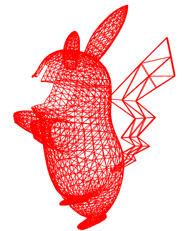
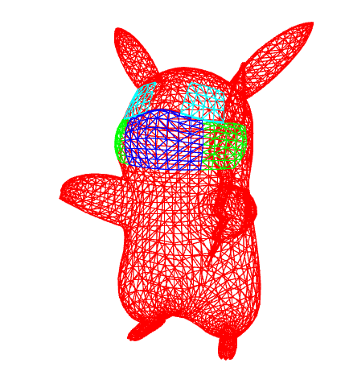
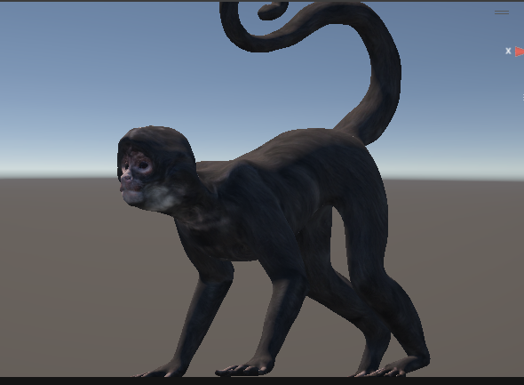
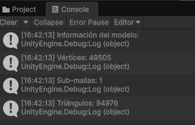
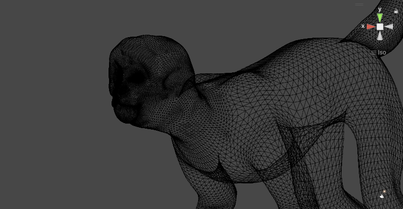

# Taller Construyendo mundo 3D
## Nombre: Juan Felipe Fajardo Garzón
## Fecha de entrega: 20/02/2026

## Descripción breve: 
Para este taller se buscaba cargar modelos 3D en diferentes entornos, una vez cargados se visualizaba de mejor manera los vértices, aristas y caras del modelo

## Implementaciones: 
### Python (Jupyter): 
Se construyó un cuaderno de jupyter en el cual se carga un modelo con formato .gltf haciendo uso de la librería trimesh, posteriormente se cuentan los vertices, aristas y caras por malla del objeto (el objeto cuenta con 4 mallas), finalmente se resaltan las aristas de la malla principal del objeto en color rojo, y luego se realiza la visualización de las 4 mallas en distintos colores

### Unity:
Se cargó un modelo de un mono araña con formato .obj, posteriormente se desarrolló un script de C# que cuenta y muestra en consola el númeor de vertices y triangulos, finalmente se cambió la visualización del modelo al modo wireframe

## Resultados visuales:

### Python:
En la siguiente imagen se puede evidenciar la malla principal del objeto pikachu, se observa que el personaje no posee cara, lo que indica que las otras 3 mallas del modelo se encuentran en el rostro


Al representar todas las mallas del objeto en diferentes colores, se evidencia claramente que le modelo está compuesto por 4 mallas; el dividir el modelo de esta forma puede ser para aplicar de una mejor forma las texturas del personaje, puesto que las mejillas, los ojos y la boca poseen detalles bastante singulares 


### Unity:
Para la implementación en Unity se hizo uso del siguiente modelo de un mono araña



Posteriormente se utilizó un script de C# para obtener información del modelo (número de vertices, caras y triangulos) e imprimirla en consola


En la siguiente imagen se presenta la vista wireframe del modelo, se evidencia que el modelo está compuesto por una única malla



## Código relevante: 

La siguiente celda de código fue la utilizada para contar los elementos (vertices, aristas y caras) del modelo Pikachu en trimesh; se hace uso de un for para recorrer todas las submallas del modelo, y se cuentan los elementos por submalla
```python
for name,malla in model.geometry.items(): #We go through all the item in the scene
    print(name)
    print("Vértices:", len(malla.vertices))
    print("Aristas:", len(malla.edges_unique))
    print("Caras:", len(malla.faces))
```

De forma similar, el siguiente fragmento de código en C# recorre todas las submallas del modelo (que en este caso solo es una), luego almacen la información en 3 variables que posteriormente imprime en consola
```c#
foreach (MeshFilter mf in meshFilters)
        {
        Mesh mesh = mf.sharedMesh;

        int vertexCount = mesh.vertexCount;
        int subMeshCount = mesh.subMeshCount;
        uint triangleCount = mesh.GetIndexCount(0) / 3;

        Debug.Log("Información del modelo:");
        Debug.Log("Vértices: " + vertexCount);
        Debug.Log("Sub-mallas: " + subMeshCount);
        Debug.Log("Triángulos: " + triangleCount);
        }
```
## Prompts utilizados: 
crea un codigo en python usando vedo que permita abrir un modelo gltf previamente descargado, explicame cada linea y su funcionamiento
Crea otro códgio usando ahora trimesh que permita abrir un modelo gltf

con que función en trimesh puedo seleccionar unicamente las aristas de un modelo

Desarrolla un script de C# que me permita contar el número de vertices, triangulos y caras de un objeto en unity


## Aprendizajes y dificultades: 
El realizar este trabajo me ayudó a entender mejor como se componen los objetos modelados en 3D, además de ello, muestra como se puede hacer uso de múltiples mallas dentro del mismo objeto con el fin de tener un mejor modelado

La principal dificultad que enfrenté en este taller fue utilizar las herramientas y librerías nuevas (Unity y trimesh), puesto que no había trabajado nunca con ellas y no conocía los métodos o funciones propias de estas