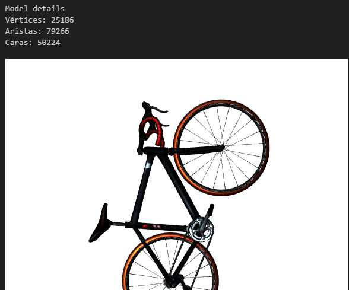
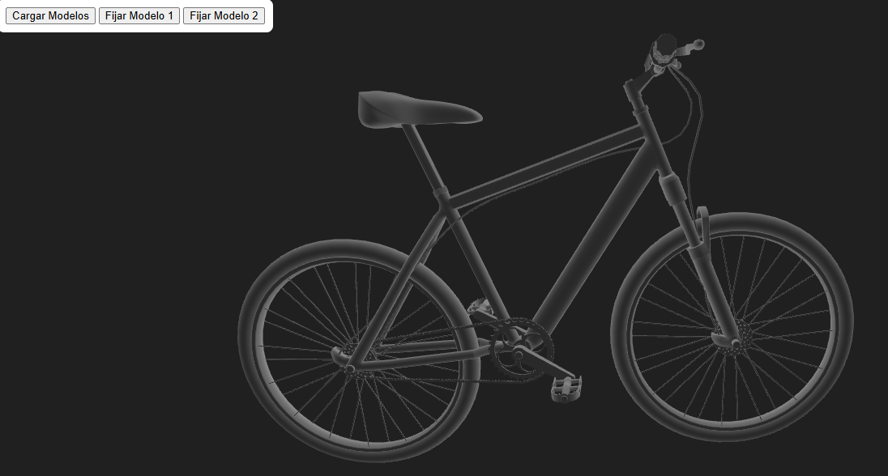
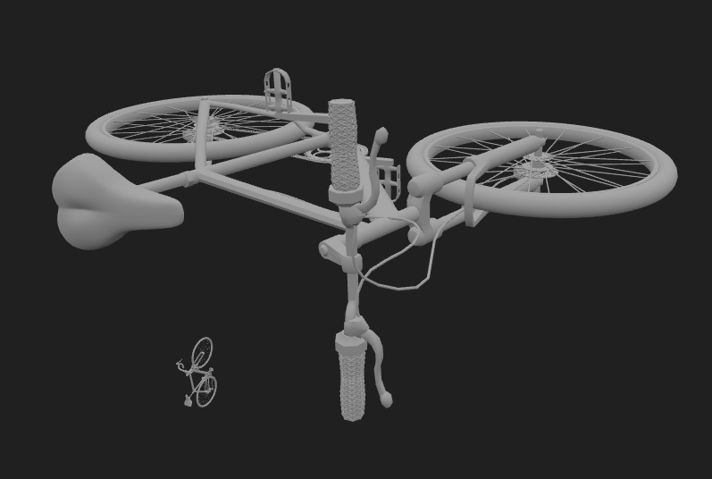

# Taller - Importando el Mundo: Visualización y Conversión de Formatos 3D
## Nombre: Juan Felipe Fajardo Garzón
## Fecha de entrega: 20/02/2026

## Descripción breve: 
Para este taller se realizó la carga de 2 modelos de bicicletas en formato OBJ con el fin de observar sus geometrías y características, además de esto, se realizó la conversión de los elementos a formato STL

## Implementaciones: 
### Python (Jupyter): 
Se construyó un cuaderno de jupyter donde inicialmente se cargó el primero modelo de bicicleta, donde se contaron elementos como número de vértices, aristas y caras, posteriomente se visualizó su malla en color rojo y se contaron los elementos anteriormente mencionados ignorando los duplicados. Luego, se construyó una función que permitiera cargar y mostrar un modelo contando sus elementos no duplicados, esta función fue utilizada para ambos modelos de bicicleta. Finalmente se realizó la conversión de ambos modelos a formato STL haciendo uso de .export()

### Three js:
Se creó un visualizador donde se pudieran cargar los 2 modelos de bicicletas, para ello, se comenzó creando elementos como la escena, cámara, iluminación y el OBJLoader; posteriormente se crearon y configuraron los controles orbitales, y por medio de un botón es posible cargar ambos modelos dentro del navegador; finalmente se implementaron 2 botones que permitan centrar la cámara en cada uno de los 2 modelos

## Resultados visuales:

### Python:
En esta imagen se observa el primer modelo de bicicleta junto con el conteo de sus elementos no duplicados, se hace uso de la función creada al final para permitir una carga más limpia


Luego se usó la misma función de visualización de modelos para cargar el segundo modelo de bicicleta, esto permitió realizar una comparación rápida entre ambos modelos, concluyendo que el segundo modelo posee un mayor grado de detalle, puesto que tiene muchos más vértices, aristas y caras que el primero modelo


### Three JS:
Es esta primera imagen se puede observar el modelo de la primera bicicleta renderizado dentro del navegador


De igual forma, se cargó el segundo modelo de la bicicleta, el cual se encuentra en la misma escena, sin embargo, esta centrado en unas cordenadas alejadas al primer modelo para poderlos distinguir de buena manera


En esta imagen se puede apreciar como ambos modelos se encuentran renderizados dentro de la misma escena



## Código relevante: 

### Python
La siguiente celda de código corresponde a la función general de python para cargar cualquier modelo, mostrarlo en el visualizador de trimesh y contar sus elementos no duplicados; en ella se hace uso de trimesh load y model.show() para cargar y mostrar el modelo, luego se hace el conteo de los elementos, para los vertices se usa la función unique de NumPy con el fin de evitar elementos repetidos, mientras que para las aristas se usa el atributo edges_unique
```python
def model_properties(path):
    model = trimesh.load(path)
    viewer = model.show()
    print("Model details")
    print("Vértices:", len(np.unique(model.vertices, axis = 0)))
    print("Aristas:", len(model.edges_unique))
    print("Caras:", len(model.faces))
    return viewer
```

### Three JS

En el siguiente fragmento de código se configura el boton de cargar los modelos dentro del navegador, (anterior a esto se ha realizado las configuraciones relativas a la escena). En este códgio se empera a que se realice click en el botón de cargar, luego se usa el OBJLOader para cargar los modelos, definiendo posiciones y escalas diferentes para los dos modelos, finalmente son añadidos a la escena 
```js
document.getElementById("btnStart").onclick = abrir;
function abrir() {
    //Cargar el modelo 1
    loader.load("11717_bicycle_v2_L1.obj", (obj) => {
    obj.position.set(10, 10, 10); //Posición del modelo
    obj.scale.setScalar(0.03); //Escalamiento del modelo
    scene.add(obj); //Añadir el modelo a la escena
});
    //Cargar el modelo 2
    loader.load("10489_bicycle_L2.obj", (obj) => {
    obj.position.set(0, 0, 0);
    obj.scale.setScalar(0.01);
    scene.add(obj);
});
}
```

Luego se implementó el siguiente código, el cual centra la cámara en cada uno de los modelos al oprimir el botón correspondiente; para ello, se cambia la posición de la cámara y de los controles orbitales a las coordenadas donde está renderizado el modelo
```js
//Funcion para fijar el modelo 1
document.getElementById("btnModel1").onclick = () => {
    camera.position.set(1, 1, 1);
    controls.target.set(0, 0, 0);
    controls.update(); 
};

//Funcion para fijar el modelo 2 
document.getElementById("btnModel2").onclick = () => {
    camera.position.set(11, 11, 11);
    controls.target.set(10, 10, 10);
    controls.update(); 
};
```


## Prompts utilizados: 
Crea un Script de three Js que me permita añadir controles orbitales a una escena

Cual es la funcion de Trimesh para exportar modelos a otro formato

Crea un script que me permita cambiar la posición de la cámara al momento de presionar un botón en three JS


## Aprendizajes y dificultades: 
Este taller el util para comprender como cargar diferentes formatos de modelos 3D, además de para profundizar mejor en temas como la posición de la cámara o de controles orbitales

La principal dificultad que enfrenté en este taller fue visualizar los modelos con three js, puesto que no había trabajado con la herramienta, y no sabía que se debían configurar bastantes parametros a la hora de crear la escena; en especial los controles orbitales fueron un reto porque al inicio no entendía como centrar el punto de rotación, por lo que los modelos desaparecían de la cámara