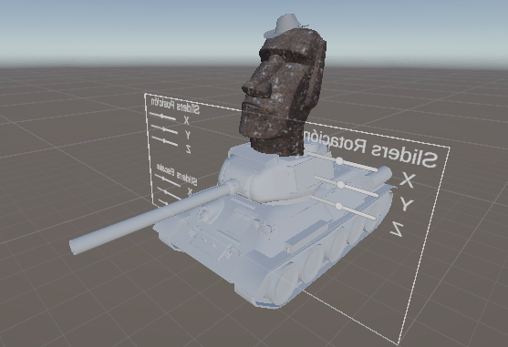
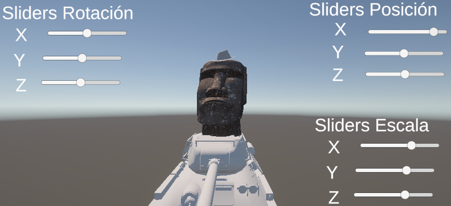
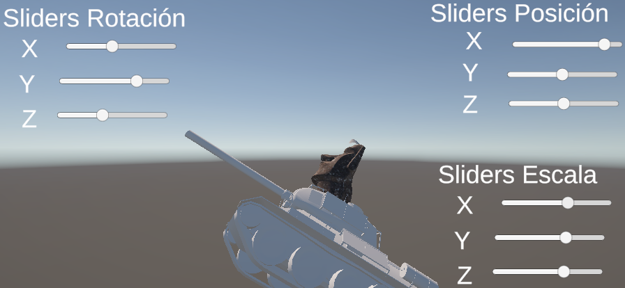
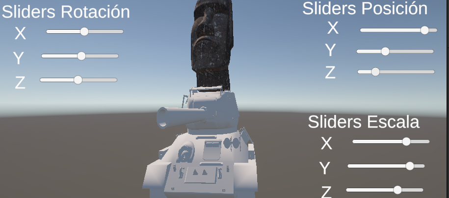

# Taller - Jerarquías y Transformaciones: El Árbol del Movimiento
## Nombre: Juan Felipe Fajardo Garzón
## Fecha de entrega: 20/02/2026

## Descripción breve: 
Para este taller se buscaba cargar 3 diferentes modelos dentro del motor unity, luego anidarlos dentro de un arbol de jerarquías con el fín de visualizar la herencia de transformaciones

## Implementaciones: 

### Unity:
Se realizó la carga de 3 modelos, un tanque T-34, una estatua de moai y un sombrero vaquero, posteriormente se estableció la jerarquía, donde el vehículo iba a ser el elemnto padre, el moai el hijo y el sombrero el elemento nieto, finalmente se crearon sliders con el fin de aplicar transformaciones al elemento padre y observar como los herederos obtienen sus transformaciones

## Resultados visuales:

### Unity:
En esta primera imagen se presenta la vista de la escena por fuera del modo simulación, donde se observan los 3 elementos que conforman el arbol de jerarquías, además de ver los sliders para aplicar transformaciones



Dentro de modo de simulación se observan los sliders en pantalla que permiten trasladar, rotar y escalar el modelo del tanque


Es las siguientes imagenes se pueden observar multiples tranformaciones al elemento padre y como los hijos las heredan





## Código relevante: 

Dentro de los assets se utilizó un script para aplicar transformadas al elemento padre, para ello se elaboró el siguiente fragmento de código que permite actualizar los atributos del elemento en cada frame; primero se guardan los valores de los sliders, y luego se utilizan los métodos .transform para hacer efectivas las transformaciones
```cs
void Update()
    {
        
        float nuevaPosicionX = posX.value;
        float nuevaPosicionY = posY.value;
        float nuevaPosicionZ = posZ.value;

        float nuevaRotacionX = rotX.value;
        float nuevaRotacionY = rotY.value;
        float nuevaRotacionZ = rotZ.value;
        
        float nuevaEscalaX = sclX.value;
        float nuevaEscalaY = sclY.value;
        float nuevaEscalaZ = sclZ.value;

        target.transform.position = new Vector3(nuevaPosicionX, nuevaPosicionY, nuevaPosicionZ);
        target.transform.localRotation = Quaternion.Euler(nuevaRotacionX, nuevaRotacionY, nuevaRotacionZ);
        target.transform.localScale = new Vector3(nuevaEscalaX, nuevaEscalaY, nuevaEscalaZ);
    }
```


## Prompts utilizados: 
Crea un script que me permita obtener los valores de sliders dentro de unity

Con que métodos puedo aplicar transformaciones a un elemento dentro de unity


## Aprendizajes y dificultades: 
Con este trabajo pude entender mucho mejor como funcionan las jerarquías entre elementos, y como trasladar o rotar un elemento "mayor" permite aplicar y manipular de mejor forma todos los elementos dentro de la escena

La principal dificultad que tuve fue ubicar los modelos dentro de la escena de modo que tuvieran una ubicación coherente, puesto que aún no me acostumbro a la forma de mover elementos entro de unity