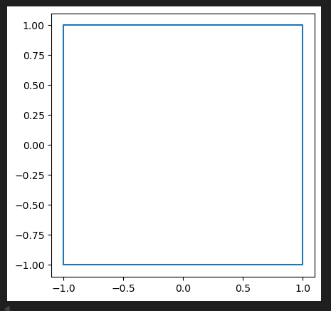
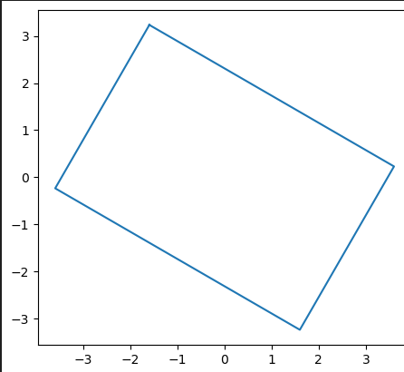
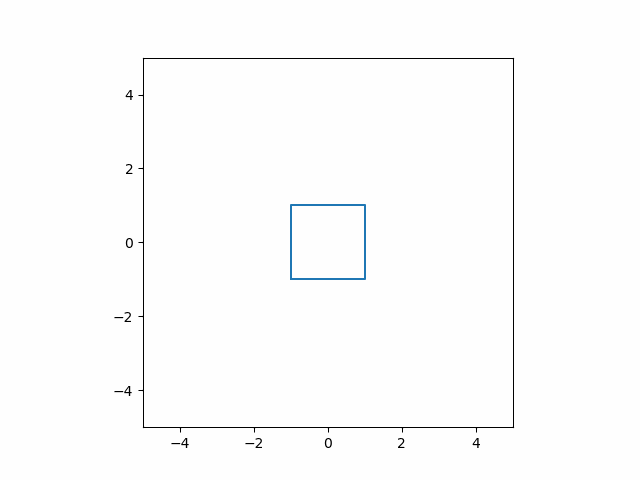
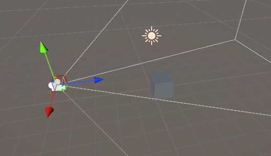
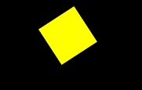
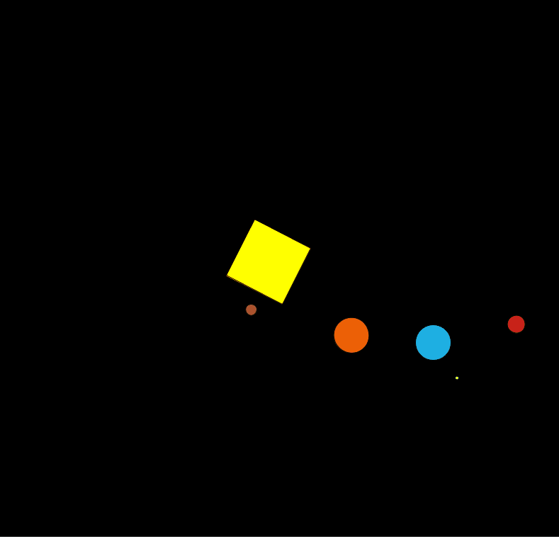

# Taller - Transformaciones Básicas en Computación Visual
## Nombre: Juan Felipe Fajardo Garzón
## Fecha de entrega: 20/02/2026

## Descripción breve: 
Para este taller se debían utilizar elementos básicos dentro de python, unity y processing con el fin de aplicarle transformaciones fundamentales, y entender como estas pueden ser utilizadas en función del tiempo o frames

## Implementaciones: 

### Python (Jupyter)

Dentro del libro de Jupyter se creó una matriz que contenía las coordenadas de los vértices de un cuadrado, luego de esto se crearon tres funciones que se encargaban de generar las matrices de transformada para trasladar, escalar y rotar el elemento 2D, una vez hecho esto se creó un bucle donde se le aplicaban transformaciones en funcion de los frames al elemento cuadrado, por cada frame se generaba un gráfico de matplotlib los cuales fueron recopilados y transformados en un GIF utilizando imageio

### Unity:
Para la implementación en unity se utilizó un cubo simple el cual fue programado para realizar las siguientes acciones:

+ Obtener una dirección y distancia aleatoria para aplicar una traslación cada n segundos aleatorios, con n entre 1 y 5 segundos

+ Aplicar una rotación de 45 grados en función del tiempo que pasa por cada frame dentro del modo simulación

+ Realizar un escalamiento siguiendo el comportamiento de una función sinusoidal con amplitud 0.2 y frecuencia 1

### Processing

En processing se intentó replicar el comportamiento de las orbitas de los 4 planetas más cercanos al sol, para ello se aplicaron rotaciones y traslaciones para centrar las orbitas en un cuadrado amarillo central (sol), donde el elemento sol se escalaba siguiento un comportamiento sinusoidal; además de ello, las elipses que representan los planetas siguien relaciones de periodo de orbitación iguales a las reales del sistema solar. Por último, el elemento tierra cuenta con una elipse de menor tamaño orbitándolo (luna), este elemento luna heredas las transformaciones de la tierra y aplica su propia rotación y traslacion para seguir su órbita

## Resultados visuales:

### Python


Incialmente se tenía el siguiente cuadrado elaborado a partir de un arreglo en numpy


Luego de aplicarle una transformacion de rotación y escalado se obtuvo la siguiente figura



Finalmente se elaboró la animación al aplicar las tranformaciones en funcion de los frames que van pasando, se puede observar como la escala comienza a reducirse con el paso del tiempo



### Unity:

Primero se agregó el elemento cubo y la cámara para permitir la visualización de las transformaciones


Luego, una vez creado el script, se visualizaron dentro del modo simulación las transformaciones anteriormente descritas al elemento cubo


Se puede observar como se traslada de forma aleatoria, se escala de forma sinusoidal y rota de forma constante


### Processing

Se comenzó modelando las transformaciones del elemento sol como un cuadrado que iba a escalarse de forma sinusoidal y rotar por la pantalla



sin embargo, al ver un comportamiento interesante de las rotaciones, se decidió por realizar una pequeña simulación de algunos planetas del sistema solar, la siguiente animación muestra los planetas orbitando alrededor del sol




## Código relevante: 

### Python
En el siguiente bloque de código se presenta el bulce utilizado para realizar la animación de las transformacions del cuadrado; primeramente se definen los parametros de las tranformaciones en funcion de los frames que trasncurren en la animación, luego se calculan las matrices de transformacion haciendo uso de las funciones correspondientes, finalmente se aplica la transformación al elemento original y se actualiza, la última sección del código corresponde a la gráfica del elemento
```python
while frame <= limit_frames:

    #Create the parameters of the transformations in function of the frame
    t = frame * 0.8
    angle = t
    sx = 1 + 0.3*np.sin(t)
    tx = 2*np.cos(t)
    ty = 2*np.sin(t)

    # Create Matrix transformations escalation, rotation and translation
    scl_m = scl_matrix(sx,sx) # Escalate 
    rot_m = rot_matrix(angle) # Rotate 
    tras_m = trans_matrix(tx,ty) # Translate

    # Create the total trasnformation matriz
    matrix_transformation = scl_m @ rot_m @ tras_m
    # Apply the trasnformations
    new_square = square_h @ matrix_transformation
    #Update the new square for the transformated square
    square_h = new_square

    # Plot the trasformation
    fig, ax = plt.subplots()
    ax.plot(new_square[:,0], new_square[:,1])
    ax.set_xlim(-5, 5)
    ax.set_ylim(-5, 5)
    ax.set_aspect('equal', adjustable='box')
```

### Unity

En esta celda se presenta la actualización se realiza en cada frame al elemento que se le aplican las transformaciones, primero se valida si se cumplió el tiempo para realizar una traslación, luego se evalúa la dirección y se aplica la transformación, en la rotación y escalamiento simplemente se ingresan los parámetros en función del tiempo de cada frame; finalmente se actualiza el contador de tiempo
``` cs
void Update()
    {   
        //traslacion aleatoria (entre 100 y 500) en sentido aleatorio (X o Y) cada n segundos aleatorios (entre 1 y 5 segundos)
        if (tiempo >= tiempoSigTraslacion)
        {  
            if (sigDireccion == 0)
            {
                target.transform.Translate(Vector3.right * velocidad * Time.deltaTime, Space.World);
            }
            else if(sigDireccion == 1)
            {
                target.transform.Translate(Vector3.up * velocidad * Time.deltaTime, Space.World);
            }
            else if(sigDireccion == 2)
            {
                target.transform.Translate(Vector3.down * velocidad * Time.deltaTime, Space.World);
            }
            else
            {
                target.transform.Translate(Vector3.left * velocidad * Time.deltaTime, Space.World);
            }
            ParametrosTraslacion();
        }
        //Rotación constante en el eje Y (45grados/seg)
        target.transform.Rotate(Vector3.up * 45f * Time.deltaTime); 

        // Escalado en función de seno
        float s = Mathf.Sin(Time.time * frecuencia) * amplitud;
        target.transform.localScale = escalaInicial + Vector3.one * s;
        
        tiempo += Time.deltaTime; //Aumentar el contador de tiempo
        
        
    }
```
A continuación se presenta la funcion utilizada para generar los nuevos parámetros de la traslación aleatoria, estos parámetros son reevaluados siempre que se aplica una traslación sobre el objeto

```cs
void ParametrosTraslacion()
    {   
        velocidad = Random.Range(100,500);
        tiempoSigTraslacion = Random.Range(1f,5f);
        sigDireccion = Random.Range(0,4);
        tiempo = 0f; //Reiniciar el contador de tiempo
    }

```

### Processing

A continuación se presenta el esquema utilizado dentro de ciclo draw para la órbita de todos los planetas, primero se realiza la traslación del origen del espacio al centro de la pantalla, allí se realiza una rotación en función del framCount y luego se traslada de nuevo el espacio para dibujar el objeto en su órbita, cada planeta tiene un radio y periodo orbital diferente (se toma como la unidad del periodo a mercurio)

Por último se dibuja la ellipse con una relación de escala comparandola con el tamaño de la tierra que es de 50px
```java
pushMatrix();
  translate((width/2), (height/2));// trasladar origen
  rotate(radians(frameCount));// rotar sobre el origen, venus es tomado como la unidad de referencia de los periodos orbitales
  translate(80,0);// trasladar el planeta a su orbita, distancia 80
  fill(171, 100, 53); // color anaranjado
  ellipse(0,0,50/3,50/3); // crear elemento con relacion de tamaño 1/3 de la tierra
  popMatrix();
```

Este esquema se repite para todos los planetas variando atributos como el periodo y tamaño de la órbita, el tamaño del planeta y el color del mismo

Para la luna se realiza el código heredando las transformaciones de la tierra, es decir abriendo el pushMatrix de la luna antes de cerrar el de la tierra
```java
//EARTH
  pushMatrix();
  translate((width/2), (height/2));
  rotate(radians(frameCount)*0.24); // periodo orbital de la tierra
  
  translate(250,0); // trasladar a la tierra a su orbita
  fill(30, 176, 227); // color azulado para la tierra
  ellipse(0,0,50,50);
  //Moon
  pushMatrix(); // guardar las transformaciones de la tierra para heredarlas
  rotate(radians(frameCount)*0.24); //periodo orbital de la luna
  translate(60, 0);
  
  fill(255); // color balnco
  ellipse(0,0,50/10,50/10); // relacion de tamaño 1/10 de la tierra (no es la relacion real, pero mas pequeño no se ve)
  popMatrix();
  popMatrix();
  ```

## Prompts utilizados: 
Crea un script de C# que me permita escalar un cubo de forma sinusoidal

Como heredo las transformaciones de un elemento dentro de processing

Crea un script en python que me permita guardar cada uno de los graficos generados por matplotlib en una animación


## Aprendizajes y dificultades: 
El taller me ayudó a comprender mucho mejor las tranformaciones y la herencia de estas, además fue divertido realizar la simulación simple del sistema solar en processing puesto que se ve de forma clara la utiliza de cada tranformación

La principal dificultad que enfrenté fue comprende los métodos de push y pop Matrix en processing, y por tanto realizar las herencias de transformaciones, puesto que no sabía a que se refería la documentación con guardar el sistema de coordenadas en una pila  